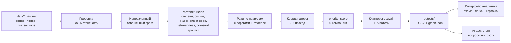

# Mirai — Граф денег

**Команда Mirai · HackAlem AI · кейс «Граф денег: восстановление финансовой структуры организованной группы по транзакционной сети»**

## О проекте

Mirai — локальное рабочее место AML-аналитика банка для исследования транзакционной сети.
Помогает ответить на вопрос **«кого проверить первым и почему»**: превращает таблицы переводов
в карту связей, гипотезы о ролях клиентов и приоритетный список с числовыми объяснениями.

Решение предназначено для аналитика, которому нужно разобраться в потоках вокруг известных
исходных клиентов (`seed`), найти точки сбора, транзита и распределения и определить следующий
шаг проверки. Используются только предоставленные транзакции и структура сети.

> Все выводы — **гипотезы для проверки**, а не утверждения о виновности.
> Приоритет — порядок проверки; `role_score` — сила соответствия правилу, не вероятность нарушения.

## Что реализовано

- **Полный расчёт из Parquet одной командой:** проверка согласованности данных, метрики,
  шесть ролей с объяснениями, кластеры, приоритеты и обязательные CSV.
- **Объяснимый анализ:** правила с порогами, вклады пяти компонент приоритета,
  проверяемые связи и чувствительность места в рейтинге к изменению весов.
- **Дополнительные признаки:** временной транзит, синхронные поступления, повторяющиеся
  маршруты, структурные циклы и оценка изменения сети при удалении приоритетных узлов.
- **Интерактивная карта:** обзор, окружение выбранного клиента, весь граф, фильтры по ролям
  и кластерам, поиск по полному или частичному `gid`, направление и суммы переводов.
- **Инструменты исследования:** карточка клиента, сравнение двух клиентов, направленный путь,
  общие получатели, история просмотра, локальные закладки и векторный экспорт текущей сцены в SVG.
- **Ассистент аналитика:** ответы по графу со ссылками на клиентов и проверяемыми действиями
  на карте. Локальный режим работает без ключей; подключение LLM необязательно.

Начальный обзор показывает 12 приоритетных клиентов. Окружение выбранного клиента начинается
с 12 крупнейших по сумме соседей; остальных можно раскрыть кнопкой. Данные при этом не удаляются.

## Основной пользовательский сценарий

1. Аналитик предоставляет три согласованных файла: клиенты, агрегированные связи и транзакции.
2. `python run.py` проверяет данные, рассчитывает результаты и открывает локальный HTTP-сервер.
3. В браузере аналитик выбирает клиента из списка приоритетов или находит его по `gid`.
4. Карточка объясняет роль и приоритет; карта показывает плательщиков, получателей и связи.
5. Аналитик проверяет путь или общих получателей, задаёт вопрос ассистенту и сопоставляет ответ
   с конкретными узлами и переводами.
6. Результат исследования — гипотеза с числовыми основаниями и оговорками о полноте данных;
   таблицы доступны в `outputs/`, выбранную сцену можно скачать как SVG.

## Установка и запуск

Понадобятся Git, Python и современный браузер. Рекомендуется **Python 3.12** — на этой версии
проводились проверки. Доступ к приватному репозиторию должен быть выдан организатором.
Интернет нужен для клонирования и установки зависимостей. После установки расчёт,
интерфейс и локальный ассистент работают без облака, GPU и API-ключей.

### macOS / Linux

```bash
git clone https://github.com/BAITC-Hacks/hack-e29d46be-mirai.git
cd hack-e29d46be-mirai
python3 -m venv .venv
source .venv/bin/activate
python -m pip install -r requirements.txt
LLM_PROVIDER=none python run.py
```

### Windows — PowerShell

Команды используют Python виртуального окружения напрямую: менять политику выполнения
PowerShell и активировать окружение не требуется.

```powershell
git clone https://github.com/BAITC-Hacks/hack-e29d46be-mirai.git
cd hack-e29d46be-mirai
py -3.12 -m venv .venv
.\.venv\Scripts\python.exe -m pip install -r requirements.txt
$env:LLM_PROVIDER = "none"
.\.venv\Scripts\python.exe run.py
```

Откройте **[http://localhost:8000](http://localhost:8000)**. Дождитесь завершения расчёта и
сообщения Uvicorn о запуске сервера. Терминал должен оставаться открытым; остановка — `Ctrl+C`.
`run.py` сам пересчитывает и проверяет выгрузки, затем запускает интерфейс.

Следующие команды выполняются из корня репозитория с Python установленного окружения
(на Windows замените `python` на `.\.venv\Scripts\python.exe`).

| Команда | Что делает |
|---|---|
| `python run.py` | пересчёт + интерфейс |
| `python run.py --no-serve` | только расчёт и проверка CSV |
| `python run.py --skip-pipeline` | интерфейс на готовых результатах |
| `python run.py --port 8018` | запуск на другом порту, если 8000 занят |
| `python run.py --no-serve --data "my-data" --out "my-results"` | расчёт другой совместимой выборки |
| `python run.py --skip-pipeline --out "my-results"` | просмотр этих результатов |

Каталог результатов: явный `--out` → переменная `MIRAI_OUTPUT_DIR` → `outputs/`.
Один и тот же каталог используется расчётом и сервером. Пути с пробелами заключайте в кавычки.
При ошибке согласованности входных данных исправьте исходные файлы: пропуск расчёта
через `--skip-pipeline` не исправляет данные.

### Необязательное подключение LLM

Для локальной проверки оставьте `LLM_PROVIDER=none`. Чтобы включить внешний API, скопируйте
[.env.example](.env.example) в `.env`, задайте провайдера и его ключ, затем перезапустите сервер.
Если ранее задана переменная `LLM_PROVIDER` в терминале, измените её тоже: окружение имеет
приоритет над `.env`.

| `LLM_PROVIDER` | Интеграция | Ключ | Модель по умолчанию в коде |
|---|---|---|---|
| `none` | локальные инструменты и шаблоны | не нужен | без модели |
| `nvidia` | NVIDIA, OpenAI-совместимый API | `NVIDIA_API_KEY` | `meta/llama-3.3-70b-instruct` |
| `openai` | OpenAI API | `OPENAI_API_KEY` | `gpt-4o-mini` |
| `anthropic` | Anthropic Messages API | `ANTHROPIC_API_KEY` | `claude-haiku-4-5-20251001` |

Модель можно переопределить через `LLM_MODEL`; она должна поддерживать вызов инструментов.
Это поддержанные кодом настройки, а не гарантия доступности конкретной модели или аккаунта.
При отсутствии ключа или ошибке API предусмотрен локальный ответ. Ключи передаются через
переменные окружения или локальный `.env`, исключённый из Git; в репозиторий их добавлять не нужно.
Подробнее: [assistant/README.md](assistant/README.md).

## Что на выходе (`outputs/`)

| Файл | Содержимое |
|---|---|
| `nodes_roles.csv` | 2 248 строк: `gid, role, role_score, cluster_id, priority_score, evidence` + метрики (лишние колонки разрешены ТЗ) |
| `clusters.csv` | 91 кластер: `cluster_id, n_nodes, n_seed, sum_kzt_internal, top_gids, hypothesis` |
| `top_nodes.csv` | топ-50 по приоритету: `rank, gid, role, priority_score, why` |
| `graph.json` | узлы с координатами, рёбра, кластеры — для интерфейса и ассистента |

Числа в таблице относятся к поставленной выборке. После записи пайплайн проверяет выгрузки:
число строк совпадает с числом входных узлов (здесь 2 248), все обязательные поля заполнены,
роли только из словаря, evidence ≤ 200 символов, топ ≥ 20, каждый `cluster_id` описан в `clusters.csv`.

---

## Технологии

| Компонент | Реализация в репозитории |
|---|---|
| Язык расчёта и сервера | Python |
| Таблицы и Parquet | pandas, NumPy, PyArrow; SciPy используется графовыми расчётами |
| Графовые алгоритмы | NetworkX: направленный граф, PageRank, betweenness, Louvain, раскладка |
| HTTP-сервер | FastAPI, Uvicorn |
| Интерфейс | HTML, CSS, JavaScript без сборки; локальная копия Cytoscape.js 3.30.4 |
| Необязательные LLM | OpenAI SDK для OpenAI/NVIDIA; HTTP-клиент стандартной библиотеки для Anthropic |
| Конфигурация | переменные окружения, python-dotenv |
| Проверки | pytest, HTTPX, встроенный тестовый запуск Node.js |

Зависимости Python перечислены в [requirements.txt](requirements.txt). Node.js нужен только
для тестов JavaScript; для запуска приложения он не требуется. Обученной собственной модели,
отдельной базы данных и обязательных внешних сервисов в текущей реализации нет.

## Данные и интеграции

Источник — три файла организаторов из [data/](data/README.md). Период поставленной выборки:
**1–31 июля 2026 года**, 81 исходный клиент (`seed`), обход исходящих переводов на четыре колена,
только внутрибанковские переводы от **5 000 ₸**. Всего **2 248 клиентов, 3 119 направленных
агрегированных связей и 4 840 транзакций**. Внешнее обогащение данными не используется.

| Файл | Обязательные поля |
|---|---|
| `nodes.parquet` | `gid`, `depth`, `is_seed` |
| `edges.parquet` | `src`, `dst`, `sum_kzt`, `n_tx`, `depth` |
| `transactions.parquet` | `src`, `dst`, `date`, `sum_kzt` |

`gid`, `src`, `dst` во входных Parquet должны быть целочисленными и помещаться в `int64`.
Суммы — положительные конечные числа; пары, суммы и количества в `edges` должны совпадать
с агрегацией `transactions`, а все участники связей — присутствовать в `nodes`.
В JSON/API идентификаторы передаются **строками**, чтобы JavaScript не округлял 18-значные числа.
CSV также следует открывать с текстовым типом столбца `gid`, если используется электронная таблица.

Другую выборку можно передать через `--data`, сохранив эти схемы. Число клиентов не зашито
в расчёт, но действующий валидатор требует минимум 20 строк в топ-листе. Предположения о четырёх
коленах, валюте и устройстве выгрузки необходимо пересмотреть для данных другого происхождения.

Интерфейс обращается к локальному API FastAPI: `/api/graph`, `/api/node/{gid}`,
`/api/search`, `/api/top`, `/api/node/{gid}/card`, `/api/ask`.
Ассистент получает рассчитанный граф из сервера. Только при включённом LLM вопросы и результаты
вызовов инструментов передаются выбранному внешнему провайдеру; в режиме `none` API модели не вызывается.

## Архитектура и алгоритмы



**Связь компонентов:** `run.py` управляет расчётом и запуском Uvicorn; `pipeline/` записывает
результаты; `app/server.py` читает их и обслуживает браузер; `assistant/` вызывается сервером
как Python-модуль и использует тот же граф. Необязательная LLM выбирает инструменты анализа,
но не рассчитывает роли, кластеры или приоритеты.

Код: `pipeline/` — `load.py` → `metrics.py` → `roles.py` → `priority.py` → `clusters.py` → `layout.py` → `export.py`,
оркестратор — `pipeline/main.py`. Пороги ролей — в `pipeline/config.py`, параметры дополнительных паттернов — в `pipeline/extras.py` и [описании методики](docs/methodology/extras-integration.md).

### Метрики узла

| Метрика | Смысл |
|---|---|
| `in_deg` / `out_deg` | сколько **разных** клиентов перевели узлу / скольким он перевёл |
| `in_kzt` / `out_kzt`, `in_tx` / `out_tx` | суммы и число переводов внутри графа (сумма и количество — разные сигналы) |
| `pass_through` | `out_kzt / in_kzt` — какую долю полученного узел отдал дальше |
| `fast_forward_share` | доля исходящей суммы в пределах **0–2 дней** от любого поступления; близость дат, без сопоставления сумм |
| `seed_exposure` | PageRank с телепортацией только в 81 seed, взвешенный суммой — структурная близость к seed по направленным связям; не доля их денег и не трассировка происхождения средств |
| `n_seed_up2` | сколько разных seed достают до узла не более чем за 2 перевода |
| `betweenness` | посредничество на **направленном невзвешенном** графе: как часто узел лежит на кратчайших направленных путях; не трассировка конкретных денег |
| `pagerank` | влияние узла, взвешенное суммой |
| `truncated_by_depth` | узел 4-го колена без исходящих — здесь остановился обход |

Дополнительно экспортируются `fast_transit_share` (FIFO-сопоставление входящей суммы с исходящей
через 1–2 дня, без повторного использования суммы), `sync_in_days`, `sync_max_payers`,
`repeated_route_count` и признаки неопределённости стока. Флаг `fast_transit` требует долю ≥80%
и исключает seed. Это отдельный показатель: у него другой знаменатель, чем у `fast_forward_share`.
Переводы в один день не имеют известного порядка, поэтому для них сохраняется только верхняя оценка.

Циклы — направленные структурные пути, не доказательство возврата той же суммы денег.
Устойчивость в `graph.json → extras.resilience` показывает удаление топ-5/10/20 именно по
итоговому `priority_score`; перечислены удалённые gid и доля исчезнувшего наблюдаемого оборота.

### Роли: правила и пороги

Пороги по степеням = `max(абсолютный минимум, перцентиль)`: на этих данных у 99% узлов ≤ 6 плательщиков,
поэтому «много» — это хвост распределения, а не число «с потолка». Правила проверяются по порядку,
срабатывает первое.

| Роль | Правило (фактический порог на данных) | Пример evidence |
|---|---|---|
| **consolidator** — точка консолидации | fan-in: ≥ **5** разных плательщиков (max(5, p98)). Если одновременно выполнен fan-out, сохраняется при `out_deg <= 2 × in_deg`, иначе выбирается distributor; флаг `gather_scatter` | «Сбор от 15 разных плательщиков (1.2 млн ₸; порог ≥5), раздаёт 17 получателям» |
| **distributor** — распределитель | fan-out: ≥ **10** разных получателей (max(10, p97)) | «Веер на 62 получателей (8.6 млн ₸; порог ≥10), входящих от 24» |
| **transit** — транзитный счёт | не seed; есть и вход, и выход; отдаёт дальше **70–130%** полученного **или ≥ 60%** исходящей суммы ушло в течение **2 дней** после поступления (флаг `rapid_outflow`; близость дат без сопоставления сумм) | «Отдаёт дальше 81% полученного (1.2 млн ₸ → 1.0 млн ₸); 85% исходящих по датам близки к поступлениям (0–2 дн.; суммы не сопоставлены)» |
| **terminal** — гипотеза конечного получателя | исходящих нет; ≥ 2 плательщиков **или** сумма входящих в верхней четверти (≥ 167 тыс ₸); глубина < 4. Включает 7 seed глубины 0 с оговоркой о неполных входящих. На границе глубины 4 — отдельное слабое правило: ≥ 3 плательщика, «сток вероятен, не доказан» | «Получил 1.1 млн ₸ от 4 плательщиков и не переводил дальше (колено 1 — обход продолжался бы)» |
| **coordinator** — кандидат в организаторы | 2-й проход по готовым ролям: получает от **≥ 2 точек сбора** (второй уровень консолидации), **или** связка «точка сбора → узел → распределители», **или** сборщик/распределитель в верхнем 1% по посредничеству, связанный с другими ключевыми узлами | «Получает от 2 точек сбора — второй уровень консолидации; вход 8 (2.2 млн ₸), выход 2» |
| **peripheral** — периферия | остальное: разовые мелкие получатели, узлы на обрыве 4-го колена, seed без переводов | «4-е колено: обход остановился здесь (исходящие не выгружались); получил 7 тыс ₸ от 1» |

`role_score` (0–1) — эвристическая сила соответствия правилу: растёт с тем, насколько узел превышает порог
(для consolidator/distributor), и с числом выполненных условий (для transit баланс и скорость одновременно
дают 1.0). Это не калиброванная вероятность роли или нарушения.

**Итог на данных:** peripheral 1 619 · terminal 281 · transit 248 (из них 202 — с быстрыми исходящими по датам) ·
distributor 48 · consolidator 36 · coordinator 16.

### Как мы учли особенности данных

| Особенность (из ТЗ) | Что сделали |
|---|---|
| **Обрыв на 4-м колене**: 444 узла без исходящих — артефакт обхода | Не считаем их конечными получателями автоматически. По умолчанию `peripheral` + флаг `truncated_by_depth` и пометка в evidence. `terminal` — только при ≥ 3 плательщиках и с формулировкой «сток вероятен, не доказан» (таких 3). Узлы колен 1–3 без исходящих — наоборот, гипотезы стоков в пределах видимости: обход бы продолжился, будь у них переводы ≥ 5 000 ₸ |
| Видны только исходящие переводы, у seed входящие занижены | Роль transit не присваивается seed (у них `pass_through` бывает > 20 по устройству выгрузки). Для соответствующих ролевых гипотез seed в evidence указана неполнота входящих |
| Сумма и число переводов — разные сигналы | Роли строятся по **числу разных контрагентов** (устойчиво к одному крупному переводу), суммы — в evidence и в компоненте объёма приоритета |
| Граф направленный | Метрики ролей и betweenness учитывают направление. Ненаправленная проекция используется для Louvain и раскладки; сценарии устойчивости также оценивают слабую связность без учёта направления |
| 19 seed без рёбер | Все 2 248 узлов попадают в выгрузку; изолированные seed — `peripheral` с флагом `isolated_seed`. Маленькое сообщество не обязательно изолировано: связи с другими кластерами сохраняются |
| Нет ground truth | Каждое правило — формула с порогом из `config.py`, каждое решение — evidence с числами. За минуту объясняется любой gid |

### priority_score — кого смотреть первым

Взвешенная сумма пяти показателей (0–1), веса в `config.PRIORITY_WEIGHTS`.
Близость к seed, объём и посредничество преобразуются в перцентили; сила роли и поведение
считаются отдельными правилами:

```
priority = 0.30 · близость к seed по потоку (seed_exposure)
         + 0.25 · сила роли (вес роли × role_score; coordinator 1.0 … peripheral 0.1)
         + 0.20 · объём денег через узел (max(in_kzt, out_kzt))
         + 0.15 · посредничество (betweenness)
         + 0.10 · поведение (близость дат исходящих и поступлений, флаги паттернов)
```

Почему так: главное для аналитика — структурная связь узла с seed, затем — предполагаемая функция
в сети, и только потом — масштаб. Это порядок проверки, а не оценка виновности.
В `top_nodes.csv` колонка `why` содержит роль, evidence и **два наиболее влияющих показателя с их значениями**;
выбор учитывает веса. Точные значения, веса и произведения доступны в `priority_components`:

> *distributor: Веер на 62 получателей (8.6 млн ₸; порог ≥10), входящих от 24 (seed: входящие занижены выгрузкой) | приоритет: близость к seed по потоку денег — 99%; сила роли — 80%*

### Кластеры

Встречные суммы A→B и B→A складываются в вес A—B. Порядок узлов/рёбер фиксирован.
Исправление прежней потери одного направления меняет состав групп; cluster_id не является
постоянным идентификатором группы между версиями расчёта.

Louvain (`networkx`, `seed=42`, вес = сумма переводов) на **неориентированной** проекции графа —
в нашем решении сообщества ищутся по суммарным связям; направление денег при этом сохраняется
в ролях и свидетельствах отдельных связей. Получилось 91 кластер (61 крупнее 3 узлов, 8 содержат > 1 seed).
Гипотеза собирается из состава ролей: например, *«в составе: 8 seed; узлов с признаками консолидации: 1»*.
Сосуществование этих узлов в сообществе не означает, что все seed переводили сборщику.
Направленный путь проверяется отдельно по рёбрам; маленький кластер не объявляется изолированным.

### Раскладка схемы

Для общего графа каждый кластер раскладывается отдельно (spring layout), кластеры стоят по спирали:
крупные ближе к центру, мелкие фрагменты по краям. Эти координаты считает пайплайн. Для окружения
клиента интерфейс строит локальную схему: плательщики слева, получатели справа, встречные связи снизу.
Скорость взаимодействия зависит от компьютера и выбранного режима карты.

---

## Интерфейс и AI-ассистент

- **Интерфейс** (`app/`, FastAPI + Cytoscape.js без сборки): топ-лист приоритетов, схема сети с цветом
  роли и направлением потоков, подсветка кластера, поиск по gid, карточка узла с evidence и связями.

- **AI-ассистент** (`assistant/`): карточка узла и ответы на вопросы аналитика на естественном языке
  **по данным графа** со ссылками на gid. Работает и без LLM (шаблонные ответы из метрик);
  с LLM — через настроенный API провайдера (`LLM_PROVIDER` в `.env`, см. `.env.example`).
  LLM не присваивает роли: код формирует фактическую часть ответа из результатов инструментов.

Примеры вопросов: «Кого стоит проверить первым и почему?», «Какие ограничения есть у данных?»,
«Покажи транзитные узлы кластера <номер из интерфейса>», «Кто переводил деньги узлу <полный gid>?».
В режиме без LLM работают локальные запросы по графу. С LLM модель выбирает инструменты
и готовые результаты; непроверенный свободный текст не становится фактом ответа.
Настройка и ограничения: [assistant/README.md](assistant/README.md).

Для интерфейса экспортируются проверяемые связи `evidence_items`, пять вкладов
`priority_components` и чувствительность `rank_stability`. Базовые роли и рейтинг
при этом не меняются. [Определения и результаты сравнения](docs/methodology/explanations.md).

## Ограничения

- **Прототип для локального исследования:** весь граф обрабатывается в памяти. Миллион узлов,
  многопользовательская эксплуатация и публичный production deployment не подтверждены.
- **Эвристики, а не обученный классификатор:** нет размеченной выборки, оценки accuracy или
  доказанной вероятности нарушения. Структурный путь и цикл не доказывают движение одной и той же суммы.
- **Интерфейс:** интерактивная карта рисуется на Canvas; SVG — формат экспорта. Фильтр по отдельным
  дням не реализован. При ограниченном показе соседей нужно раскрывать окружение для просмотра остальных.
- **SVG:** сохраняет текущие координаты, изгибы и стили всей сцены, включая элементы за краями окна.
  Скрытые подписи не добавляются автоматически; точные `gid` остаются в метаданных элементов.
  Отдельная легенда ролей и таблица подписей всех узлов в экспорт не добавляются.
- **Состояние исследования:** закладки сохраняются в браузере, но история чата и ручные координаты
  узлов не являются постоянным хранилищем. Вопросы отправляются независимо, с явным контекстом клиента.
- **Полнота паттернов:** поиск циклов и повторяющихся маршрутов ограничен временем и количеством;
  признаки полноты доступны в `extras`. Отсутствие результата не доказывает отсутствия паттерна.
- **Ассистент без LLM:** распознаёт поддержанные типы вопросов; произвольные формулировки могут
  потребовать перефразирования. Работа внешних моделей зависит от ключа, сети и доступности API.
- **Режим демонстрационных данных:** при отсутствии `outputs/graph.json` сервер может использовать
  `shared/sample_graph.json` с пометкой `DEMO-DATA`. Для оценки на данных кейса сначала выполните расчёт.
- **Воспроизводимость:** версии Python-зависимостей ограничены снизу, полного lock-файла нет.
  Проверка на целевом ноутбуке и браузере обязательна для подготовки показа.
- **Видимость**: только внутрибанковские исходящие переводы ≥ 5 000 ₸ за июль 2026. Дробление ниже порога,
  внешние поступления и переводы в другие банки не видны — роли описывают поведение **внутри выгрузки**.
- **Нет ground truth**: пороги подобраны по распределению данных и типовым AML-паттернам (fan-in, fan-out,
  gather-scatter, сквозной транзит), а не обучены. Их легко пересмотреть в `config.py`.
- **coordinator** — самый гипотетический класс: без данных выше по цепочке (входящие к организатору
  извне) это «кандидат», а не вывод.
- Louvain использует фиксированный seed и упорядоченную проекцию. Для воспроизведения используйте те же
  входные файлы и версии библиотек: другая версия алгоритма может иначе разбить сообщества.

## Как проверить решение — сценарий для жюри

### Проверка расчёта и интерфейса

1. Выполните установку выше и запустите `python run.py` в режиме `LLM_PROVIDER=none`.
   Для поставленных файлов ожидаются 2 248 клиентов и 3 119 связей в интерфейсе;
   в `outputs/` — три CSV и `graph.json`. Пайплайн завершает расчёт проверкой выгрузок.
2. Выберите любого клиента из списка приоритетов. В карточке найдите роль, объяснение с числами,
   входящую/исходящую сумму и раздел «Как рассчитан приоритет».
3. Скопируйте полный `gid` выбранного клиента в поиск и нажмите Enter или выберите найденного клиента.
   Он должен открыться без потери цифр.
   Перейдите к окружению клиента: проверьте направления стрелок и значения выбранной связи.
4. Спросите ассистента: «Кто переводил деньги узлу <полный gid>?». Сопоставьте ссылки
   и суммы в ответе с входящими связями. Вопрос «Какие ограничения есть у данных?»
   должен объяснять неполноту выборки. Эти сценарии не требуют внешней модели.
5. Для воспроизводимого примера найдите `100000001616816100`, затем спросите ассистента:
   «Покажи путь от 100000004015047100 до 100000001616816100». Нажмите «Показать путь»:
   должна подсветиться существующая направленная связь. Оставьте путь выделенным до экспорта.
6. Выберите «Ещё» → «Скачать SVG», откройте файл отдельно и увеличьте масштаб.
   Сравните сторону дуги, зелёные обводки узлов, стрелки и подписи с картой.
7. После экспорта нажмите «Назад» для восстановления вида. В ответе ассистента нажмите ссылку `gid`,
   откройте карточку и проверьте кнопку «← Вернуться к ответу ассистента».
8. Откройте CSV: у каждого клиента должны быть роль, `role_score`, `cluster_id`,
   `priority_score` и текстовое `evidence` с числами; для исходной выборки в топ-листе 50 строк.

При выборе произвольной пары отсутствие пути или общего получателя — допустимый результат.

### Автоматические проверки

В активированном окружении из корня репозитория:

```bash
python run.py --no-serve
python -m pip install pytest pytest-subtests httpx
python -m pytest -q tests app/tests assistant/tests
python -m assistant.evaluate --graph outputs/graph.json
```

На Windows используйте `.\.venv\Scripts\python.exe` вместо `python`.
Оценщик ассистента выполняет 12 локальных сценариев и два дополнительных вопроса с контекстом/направлением,
проверяет ссылки и действия без обращения к API. Это проверка ответов, а не точности выявления нарушений.

Если установлен Node.js, дополнительно проверьте модели интерфейса, HTTP-обработку и SVG:

```bash
node --test app/tests/test_graph_model.cjs app/tests/test_http.cjs app/tests/test_svg.cjs
```

Тесты проверяют расчётные правила, входные данные, выгрузки, сервер, ассистента и логику интерфейса.
Их успешное выполнение не заменяет визуальный прогон в браузере на компьютере показа.
На коде `3648ed4` (23 сентября 2026, macOS / Python 3.12) повторно прошли 200 Python-тестов,
8 дополнительных проверок и 24 JavaScript-теста. Пересчёт исходных Parquet дал 2 248 клиентов,
3 119 связей, 91 кластер и топ-50. Настоящий сервер с отдельной папкой `--out` прошёл проверки
поиска, карточки, топа и указанного направленного пути. Живые LLM этим прогоном не проверялись.
Сценарий демонстрации: [docs/DEMO.md](docs/DEMO.md).
Аудит требований и методологии: [docs/FINAL_AUDIT.md](docs/FINAL_AUDIT.md).

## Развёрнутая версия

**Публичный адрес развёрнутого приложения в репозитории не указан.** Предусмотрен локальный
запуск на [http://localhost:8000](http://localhost:8000); этот адрес доступен на компьютере,
где запущен сервер, и не является публичным демо. Uvicorn по умолчанию слушает `127.0.0.1`.

## План масштабирования до ~1 млн узлов — не реализован

| Сейчас (2 248 узлов) | При ~1 млн узлов |
|---|---|
| `networkx`, весь граф в памяти | `igraph` / `graph-tool` (C/C++) или `cuGraph`; рёбра в Parquet + DuckDB/Polars |
| точный betweenness O(V·E) | приближённый betweenness по выборке k источников (k ≈ 500–1000) |
| PageRank от seed | разреженные/распределённые вычисления с контролем сходимости и числа итераций |
| сквозной транзит по всем транзакциям в Python | оконный join в DuckDB/Spark по `(dst = src, date ≤ date + 2)` |
| Louvain на всём графе | рассмотреть Leiden (`leidenalg`) и иерархические сообщества, сравнить качество и время на целевом масштабе |
| раскладка всего графа | раскладка на сервере по кластерам + показ эго-сети / топ-N по запросу, WebGL-рендер (sigma.js) |
| батч раз в выгрузку | инкрементальный пересчёт метрик только для затронутых компонент |

Это направление дальнейшей разработки, а не результат нагрузочного тестирования.
Локальные правила ролей можно сохранить по смыслу, но глобальные метрики, пороги,
временные паттерны и качество приближений потребуют отдельной проверки.

---

## Структура репозитория

```
run.py              одна команда: пайплайн + интерфейс
pipeline/           метрики, роли, приоритет, кластеры, раскладка, выгрузки; config.py — пороги ролей
outputs/            nodes_roles.csv, clusters.csv, top_nodes.csv, graph.json
app/                интерфейс аналитика (FastAPI + Cytoscape.js)
assistant/          AI-ассистент (карточки узлов, вопросы по графу)
shared/             sample_graph.json — синтетический мок для разработки (make_sample.py)
data/, starter/     данные и стартовый код организаторов (не изменялись)
docs/               ТЗ, контракты между частями, план команды
```

## Команда Mirai

| | Роль |
|---|---|
| Мирас ([@ausmiras-glitch](https://github.com/ausmiras-glitch)) | ведущий агент и пайплайн: метрики, роли, паттерны, приоритет, кластеры, интеграция; README |
| Нурай ([@nqori](https://github.com/nqori)) | интерфейс аналитика |
| Даниал ([@dnurboluly01-cmd](https://github.com/dnurboluly01-cmd)) | AI-ассистент, вопросы и проверяемые действия на карте |
