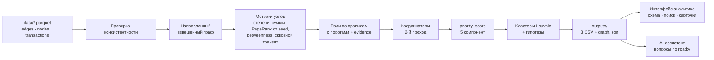

# Граф денег — кого из 2 248 клиентов смотреть первым и почему

**Команда Mirai · HackAlem AI · кейс «Граф денег: восстановление финансовой структуры организованной группы по транзакционной сети»**

Инструмент для AML-аналитика банка второго уровня. На вход — выгрузка исходящих переводов 81 клиента,
проходящих по делу, на 4 колена (2 248 узлов, 3 119 рёбер, 4 840 транзакций). На выход — роль каждого
узла с объяснением на цифрах, кластеры с гипотезой назначения, ранжированный список приоритетов
и интерактивная схема сети.

> Все выводы — **гипотезы для проверки** («признаки консолидации»), а не утверждения о виновности.
> Решение не использует и не выдумывает персональные атрибуты: только структура переводов и суммы.

---

## Быстрый старт

Нужен Python 3.10+. Интернет нужен для первой установки зависимостей и необязательного LLM. После установки основной пайплайн и локальный интерфейс работают без LLM. Инструкция для демо на Windows — [docs/DEMO.md](docs/DEMO.md).

```bash
pip install -r requirements.txt
python run.py
```

`run.py` пересчитывает всё от сырых parquet до выгрузок, сам проверяет их
и запускает интерфейс. Откройте http://localhost:8000 в браузере. На машине разработки
прогон занимает 2–12 секунд; норматив кейса — менее 5 минут. Время на Windows нужно проверить на ноутбуке демо.

| Команда | Что делает |
|---|---|
| `python run.py` | пайплайн + интерфейс |
| `python run.py --no-serve` | только пайплайн (3 CSV + graph.json в `outputs/`) |
| `python run.py --skip-pipeline` | только интерфейс на уже посчитанных выгрузках |
| `python run.py --no-serve --data путь/к/data --out путь/к/outputs` | выгрузки в другие папки; интерфейс пока читает стандартную `outputs/` |

## Что на выходе (`outputs/`)

| Файл | Содержимое |
|---|---|
| `nodes_roles.csv` | 2 248 строк: `gid, role, role_score, cluster_id, priority_score, evidence` + метрики (лишние колонки разрешены ТЗ) |
| `clusters.csv` | 91 кластер: `cluster_id, n_nodes, n_seed, sum_kzt_internal, top_gids, hypothesis` |
| `top_nodes.csv` | топ-50 по приоритету: `rank, gid, role, priority_score, why` |
| `graph.json` | узлы с координатами, рёбра, кластеры — для интерфейса и ассистента |

После записи пайплайн сам проверяет выгрузки: ровно 2 248 строк, все обязательные поля заполнены,
роли только из словаря, evidence ≤ 200 символов, топ ≥ 20, каждый `cluster_id` описан в `clusters.csv`.

---

## Как это работает



Код: `pipeline/` — `load.py` → `metrics.py` → `roles.py` → `priority.py` → `clusters.py` → `layout.py` → `export.py`,
оркестратор — `pipeline/main.py`. Пороги ролей — в `pipeline/config.py`, параметры дополнительных паттернов — в `pipeline/extras.py` и [описании методики](docs/methodology/extras-integration.md).

### Метрики узла

| Метрика | Смысл |
|---|---|
| `in_deg` / `out_deg` | сколько **разных** клиентов перевели узлу / скольким он перевёл |
| `in_kzt` / `out_kzt`, `in_tx` / `out_tx` | суммы и число переводов внутри графа (сумма и количество — разные сигналы) |
| `pass_through` | `out_kzt / in_kzt` — какую долю полученного узел отдал дальше |
| `fast_forward_share` | доля исходящей суммы в пределах **0–2 дней** от любого поступления; близость дат, без сопоставления сумм |
| `seed_exposure` | PageRank с телепортацией только в 81 seed, взвешенный суммой — структурная близость к seed по направленным связям; не доля их денег и не трассировка происхождения средств |
| `n_seed_up2` | сколько разных seed достают до узла не более чем за 2 перевода |
| `betweenness` | посредничество на **направленном** графе: сколько «кратчайших путей денег» проходит через узел |
| `pagerank` | влияние узла, взвешенное суммой |
| `truncated_by_depth` | узел 4-го колена без исходящих — здесь остановился обход |

Дополнительно экспортируются `fast_transit_share` (FIFO-сопоставление входящей суммы с исходящей
через 1–2 дня, без повторного использования суммы), `sync_in_days`, `sync_max_payers`,
`repeated_route_count` и признаки неопределённости стока. Флаг `fast_transit` требует долю ≥80%
и исключает seed. Это отдельный показатель: у него другой знаменатель, чем у `fast_forward_share`.
Переводы в один день не имеют известного порядка, поэтому для них сохраняется только верхняя оценка.

Циклы — направленные структурные пути, не доказательство возврата той же суммы денег.
Устойчивость в `graph.json → extras.resilience` показывает удаление топ-5/10/20 именно по
итоговому `priority_score`; перечислены удалённые gid и доля исчезнувшего наблюдаемого оборота.

### Роли: правила и пороги

Пороги по степеням = `max(абсолютный минимум, перцентиль)`: на этих данных у 99% узлов ≤ 6 плательщиков,
поэтому «много» — это хвост распределения, а не число «с потолка». Правила проверяются по порядку,
срабатывает первое.

| Роль | Правило (фактический порог на данных) | Пример evidence |
|---|---|---|
| **consolidator** — точка консолидации | fan-in: ≥ **5** разных плательщиков (max(5, p98)). Если узел одновременно раздаёт ≥ 10 получателям — роль по доминирующей стороне (в 2 раза больше), флаг `gather_scatter` | «Сбор от 15 разных плательщиков (1.2 млн ₸; порог ≥5), раздаёт 17 получателям» |
| **distributor** — распределитель | fan-out: ≥ **10** разных получателей (max(10, p97)) | «Веер на 62 получателей (8.6 млн ₸; порог ≥10), входящих от 24» |
| **transit** — транзитный счёт | не seed; есть и вход, и выход; отдаёт дальше **70–130%** полученного **или ≥ 60%** исходящей суммы ушло в течение **2 дней** после поступления (флаг `rapid_outflow`; близость дат без сопоставления сумм) | «Отдаёт дальше 81% полученного (1.2 млн ₸ → 1.0 млн ₸); 85% исходящих по датам близки к поступлениям (0–2 дн.; суммы не сопоставлены)» |
| **terminal** — гипотеза конечного получателя | исходящих нет; ≥ 2 плательщиков **или** сумма входящих в верхней четверти (≥ 167 тыс ₸); глубина < 4. Включает 7 seed глубины 0 с оговоркой о неполных входящих. На границе глубины 4 — отдельное слабое правило: ≥ 3 плательщика, «сток вероятен, не доказан» | «Получил 1.1 млн ₸ от 4 плательщиков и не переводил дальше (колено 1 — обход продолжался бы)» |
| **coordinator** — кандидат в организаторы | 2-й проход по готовым ролям: получает от **≥ 2 точек сбора** (второй уровень консолидации), **или** связка «точка сбора → узел → распределители», **или** сборщик/распределитель в верхнем 1% по посредничеству, связанный с другими ключевыми узлами | «Получает от 2 точек сбора — второй уровень консолидации; вход 8 (2.2 млн ₸), выход 2» |
| **peripheral** — периферия | остальное: разовые мелкие получатели, узлы на обрыве 4-го колена, seed без переводов | «4-е колено: обход остановился здесь (исходящие не выгружались); получил 7 тыс ₸ от 1» |

`role_score` (0–1) — эвристическая сила соответствия правилу: растёт с тем, насколько узел превышает порог
(для consolidator/distributor), и с числом выполненных условий (для transit баланс и скорость одновременно
дают 1.0). Это не калиброванная вероятность роли или нарушения.

**Итог на данных:** peripheral 1 619 · terminal 281 · transit 248 (из них 202 — с быстрыми исходящими по датам) ·
distributor 48 · consolidator 36 · coordinator 16.

### Как мы учли особенности данных

| Особенность (из ТЗ) | Что сделали |
|---|---|
| **Обрыв на 4-м колене**: 444 узла без исходящих — артефакт обхода | Не считаем их конечными получателями автоматически. По умолчанию `peripheral` + флаг `truncated_by_depth` и пометка в evidence. `terminal` — только при ≥ 3 плательщиках и с формулировкой «сток вероятен, не доказан» (таких 3). Узлы колен 1–3 без исходящих — наоборот, гипотезы стоков в пределах видимости: обход бы продолжился, будь у них переводы ≥ 5 000 ₸ |
| Видны только исходящие переводы, у seed входящие занижены | Роль transit не присваивается seed (у них `pass_through` бывает > 20 по устройству выгрузки). В evidence seed-узлов пометка «входящие занижены выгрузкой» |
| Сумма и число переводов — разные сигналы | Роли строятся по **числу разных контрагентов** (устойчиво к одному крупному переводу), суммы — в evidence и в компоненте объёма приоритета |
| Граф направленный | Все метрики ролей и betweenness — на направленном графе. Ненаправленная проекция используется **только** для Louvain и раскладки (оговорено ниже) |
| 19 seed без рёбер | Все 2 248 узлов попадают в выгрузку; изолированные seed — `peripheral` с флагом `isolated_seed`. Маленькое сообщество не обязательно изолировано: связи с другими кластерами сохраняются |
| Нет ground truth | Каждое правило — формула с порогом из `config.py`, каждое решение — evidence с числами. За минуту объясняется любой gid |

### priority_score — кого смотреть первым

Взвешенная сумма пяти показателей (0–1), веса в `config.PRIORITY_WEIGHTS`.
Близость к seed, объём и посредничество преобразуются в перцентили; сила роли и поведение
считаются отдельными правилами:

```
priority = 0.30 · близость к seed по потоку (seed_exposure)
         + 0.25 · сила роли (вес роли × role_score; coordinator 1.0 … peripheral 0.1)
         + 0.20 · объём денег через узел (max(in_kzt, out_kzt))
         + 0.15 · посредничество (betweenness)
         + 0.10 · поведение (близость дат исходящих и поступлений, флаги паттернов)
```

Почему так: главное для аналитика — структурная связь узла с seed, затем — предполагаемая функция
в сети, и только потом — масштаб. Это порядок проверки, а не оценка виновности.
В `top_nodes.csv` колонка `why` содержит роль, evidence и **два наиболее влияющих показателя с их значениями**;
выбор учитывает веса. Точные значения, веса и произведения доступны в `priority_components`:

> *distributor: Веер на 62 получателей (8.6 млн ₸; порог ≥10), входящих от 24 (seed: входящие занижены выгрузкой) | приоритет: близость к seed по потоку денег — 99%; сила роли — 80%*

### Кластеры

Встречные суммы A→B и B→A складываются в вес A—B. Порядок узлов/рёбер фиксирован.
Исправление прежней потери одного направления меняет состав групп; cluster_id не является
постоянным идентификатором группы между версиями расчёта.

Louvain (`networkx`, `seed=42`, вес = сумма переводов) на **неориентированной** проекции графа —
в нашем решении сообщества ищутся по суммарным связям; направление денег при этом сохраняется
в ролях и свидетельствах отдельных связей. Получилось 91 кластер (61 крупнее 3 узлов, 8 содержат > 1 seed).
Гипотеза собирается из состава ролей: например, *«в составе: 8 seed; узлов с признаками консолидации: 1»*.
Сосуществование этих узлов в сообществе не означает, что все seed переводили сборщику.
Направленный путь проверяется отдельно по рёбрам; маленький кластер не объявляется изолированным.

### Раскладка схемы

Каждый кластер раскладывается отдельно (spring layout), кластеры стоят по спирали от центра — крупные
в центре, мелкие фрагменты по краям. Координаты считаются в пайплайне, браузер только рисует
(2 248 узлов без тормозов).

---

## Интерфейс и AI-ассистент

- **Интерфейс** (`app/`, FastAPI + Cytoscape.js без сборки): топ-лист приоритетов, схема сети с цветом
  роли и направлением потоков, подсветка кластера, поиск по gid, карточка узла с evidence и связями.

- **AI-ассистент** (`assistant/`): карточка узла и ответы на вопросы аналитика на естественном языке
  **по данным графа** со ссылками на gid. Работает и без LLM (шаблонные ответы из метрик);
  с LLM — через OpenAI-совместимый API (`LLM_PROVIDER` в `.env`, см. `.env.example`).
  LLM не присваивает роли и не выдумывает факты — только объясняет посчитанное.

Примеры вопросов: «Кого стоит проверить первым и почему?», «Какие ограничения есть у данных?»,
«Покажи транзитные узлы кластера 3», «Кто переводил деньги узлу <полный gid>?».
В режиме без LLM работают локальные запросы по графу. С LLM модель выбирает инструменты
и готовые результаты; непроверенный свободный текст не становится фактом ответа.
Настройка и ограничения: [assistant/README.md](assistant/README.md).

Для интерфейса экспортируются проверяемые связи `evidence_items`, пять вкладов
`priority_components` и чувствительность `rank_stability`. Базовые роли и рейтинг
при этом не меняются. [Определения и результаты сравнения](docs/methodology/explanations.md).

## Ограничения

- **Видимость**: только внутрибанковские исходящие переводы ≥ 5 000 ₸ за июль 2026. Дробление ниже порога,
  внешние поступления и переводы в другие банки не видны — роли описывают поведение **внутри выгрузки**.
- **Нет ground truth**: пороги подобраны по распределению данных и типовым AML-паттернам (fan-in, fan-out,
  gather-scatter, сквозной транзит), а не обучены. Их легко пересмотреть в `config.py`.
- **coordinator** — самый гипотетический класс: без данных выше по цепочке (входящие к организатору
  извне) это «кандидат», а не вывод.
- Louvain использует фиксированный seed и упорядоченную проекцию. Для воспроизведения используйте те же
  входные файлы и версии библиотек: другая версия алгоритма может иначе разбить сообщества.

## Проверка перед сдачей

```bash
python run.py --no-serve
pip install pytest httpx
python -m pytest -q tests app/tests assistant/tests
```

Первый шаг пересчитывает результаты из исходных данных и проверяет обязательные CSV. Затем запустите
`python run.py --skip-pipeline`: выберите клиента из приоритетов, найдите его по полному gid,
откройте связи и задайте ассистенту вопрос «Кто ему отправлял?». При `LLM_PROVIDER=none` ответы
строятся локально. Новые графовые функции проверяются отдельно в Node: `node --test app/tests/*.cjs`
(Node нужен только для тестов интерфейса, не для запуска приложения).

[Финальный аудит и соответствие исходному кейсу](docs/FINAL_AUDIT.md),
[сценарий пяти минут и схема для демо 29 сентября](docs/DEMO.md).

## Масштабирование до ~1 млн узлов

| Сейчас (2 248 узлов) | При ~1 млн узлов |
|---|---|
| `networkx`, всё в памяти, ~2 с | `igraph` / `graph-tool` (C/C++) или `cuGraph`; рёбра в Parquet + DuckDB/Polars |
| точный betweenness O(V·E) | приближённый betweenness по выборке k источников (k ≈ 500–1000) |
| PageRank от seed | тот же personalized PageRank — линеен по рёбрам, масштабируется |
| сквозной транзит по всем транзакциям в Python | оконный join в DuckDB/Spark по `(dst = src, date ≤ date + 2)` |
| Louvain на всём графе | Leiden (`leidenalg`) — быстрее и стабильнее; иерархические сообщества |
| раскладка всего графа | раскладка на сервере по кластерам + показ эго-сети / топ-N по запросу, WebGL-рендер (sigma.js) |
| батч раз в выгрузку | инкрементальный пересчёт метрик только для затронутых компонент |

Правила ролей не меняются: они локальные (степени, суммы, соседи) и считаются за O(V + E).

---

## Структура репозитория

```
run.py              одна команда: пайплайн + интерфейс
pipeline/           метрики, роли, приоритет, кластеры, раскладка, выгрузки; config.py — пороги ролей
outputs/            nodes_roles.csv, clusters.csv, top_nodes.csv, graph.json
app/                интерфейс аналитика (FastAPI + Cytoscape.js)
assistant/          AI-ассистент (карточки узлов, вопросы по графу)
shared/             sample_graph.json — синтетический мок для разработки (make_sample.py)
data/, starter/     данные и стартовый код организаторов (не изменялись)
docs/               ТЗ, контракты между частями, план команды
```

## Команда Mirai

| | Роль |
|---|---|
| Мирас ([@ausmiras-glitch](https://github.com/ausmiras-glitch)) | ведущий агент и пайплайн: метрики, роли, паттерны, приоритет, кластеры, интеграция; README |
| Нурай ([@nqori](https://github.com/nqori)) | интерфейс аналитика |
| Даниал ([@dnurboluly01-cmd](https://github.com/dnurboluly01-cmd)) | AI-ассистент, вопросы и проверяемые действия на карте |
