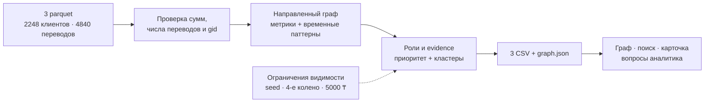

# Демо Mirai: Даниал, Windows, 5 минут

## Подготовка ноутбука до 17:00

Из корня актуальной копии репозитория в PowerShell (Python 3.10+):

```powershell
py -m venv .venv
.\.venv\Scripts\python.exe -m pip install -r requirements.txt
$env:LLM_PROVIDER = "none"
.\.venv\Scripts\python.exe run.py
```

Открыть `http://localhost:8000`. Активация venv не нужна: это исключает проблемы
с политикой выполнения PowerShell. Если команда `py` отсутствует, использовать
установленный `python` для создания venv. Сервер оставить работающим в терминале.
При занятом порте: `run.py --port 8001`, затем открыть `http://localhost:8001`.

Сначала проверить без LLM, затем отдельно с выбранным провайдером и моделью.
Ключи — только в локальном `.env`, не показывать их на проекторе. Для возврата
к настройкам `.env` убрать переменную PowerShell: `Remove-Item Env:LLM_PROVIDER`.
Наличие Astra у агента разработки не означает, что приложение настроено на этот LLM.

До демо проверить:

- Появилось сообщение `проверка выгрузок: OK`, 2248 узлов, 91 кластер, топ-50.
- Все четыре файла в `outputs/` обновились после запуска.
- В интерфейсе есть граф, направления стрелок, топ-лист и фильтр кластера.
- Полный 18-значный gid из топ-листа находится без округления; карточка открывается.
- Два других gid выбираются из CSV, включая узел 4-го колена: находятся и объясняются.
- Пустой/несуществующий gid и непонятный вопрос показывают понятный ответ, экран остаётся рабочим.
- При отключённом интернете граф, поиск и шаблонная карточка продолжают работать.

Фактический тест на Windows должен выполнить Даниал: проверки на macOS не подтверждают
готовность конкретного ноутбука. До проверки использовать обычную папку `outputs/`;
нестандартный `--out` предназначен для запуска с `--no-serve`.

## Показ по минутам

| Время | Действие | Что сказать |
|---|---|---|
| 0:00–0:40 | Запустить `run.py`, показать итог в терминале | «Из трёх исходных parquet получаем роли для всех клиентов, кластеры и список приоритетов одной командой». |
| 0:40–1:20 | Открыть топ-лист и выбрать верхний узел | «Приоритет объясняется близостью к seed, ролью, оборотом, посредничеством и поведенческими признаками». |
| 1:20–2:20 | Показать карточку и эго-граф сборщика/распределителя из данных | Прочитать evidence: число разных контрагентов, входящую/исходящую сумму и правило роли. Указать направление стрелок. |
| 2:20–3:10 | Найти второй gid, открыть его кластер | «Группы построены Louvain; гипотеза назначения опирается на состав ролей и поток внутри группы». |
| 3:10–4:00 | Найти узел 4-го колена и показать предупреждение | «Дальнейшие переводы не выгружены. Отсутствие исходящих здесь не доказывает, что деньги остались. Это гипотезы для проверки». |
| 4:00–4:40 | Показать вопрос ассистенту, заранее проверенный на финальной сборке | «Ассистент объясняет посчитанные данные и даёт ссылки на клиентов; роли назначаются воспроизводимыми правилами». При проблеме LLM показать шаблонную карточку. |
| 4:40–5:00 | Показать CSV и ограничения | «Выгрузки готовы для аналитика. Не видим другие банки, суммы ниже 5000 ₸ и внешние входящие. Следующий шаг — запросить недостающие данные». |

Не выбирать клиентов по зашитому в коде списку: брать актуальные строки из CSV.
Если жюри называет свой gid, искать его полностью и объяснять цифры в карточке.
Непроверенный свободный диалог с LLM не должен задерживать обязательную часть демо.

## Один слайд: схема решения



## План до закрытия в 18:00

- До 16:15 — мерж проверенных зависимостей и исправлений, ответственные подтверждают свои PR.
- 16:15–16:40 — чистый запуск на Windows, три произвольных gid, офлайн-режим, вопросы ассистенту.
- 16:40–17:00 — исправить только обнаруженные блокеры, пересоздать финальные CSV, повторить затронутые проверки.
- 17:00 — зафиксировать SHA демонстрации и прекратить добавление функций.
- 17:00–17:30 — два прогона по 5 минут, подготовить запасной запуск `--skip-pipeline` на тех же выгрузках.
- 17:30–18:00 — проверить ссылку репозитория, README, CSV и сдачу; резерв на организационные задержки.
